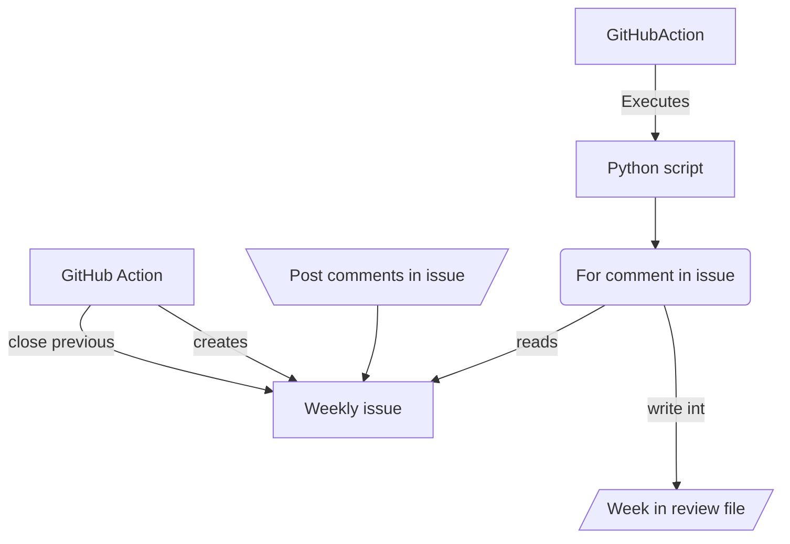

## Idea
Use GitHub actions to automated blog posting.
## GitHub Actions
Describe what are GitHub actions
### Automate issue creating
Use issue per week to track the content to be published. One issue one post. Close previous issue
### Automate content creation
- Content comes from comments
- Use `#tag` to classify the content

