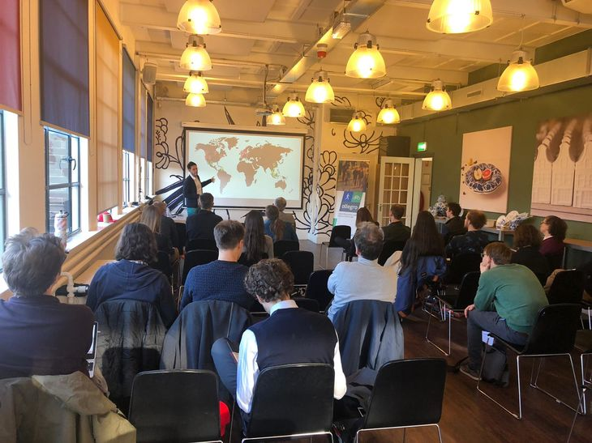

During the fall I have been presenting some of my work in different venues and meeting with new collaborators.

## Delft, The Netherlands
---

### T.U. Delft

### Cycling Research Board Meeting

## Timisoara, Romania
---
### Data Science MeetUp
### FabLab Seminar Series

## Lisbon, Portugal
---
### 8th International Conference on Complex Networks and their Applications